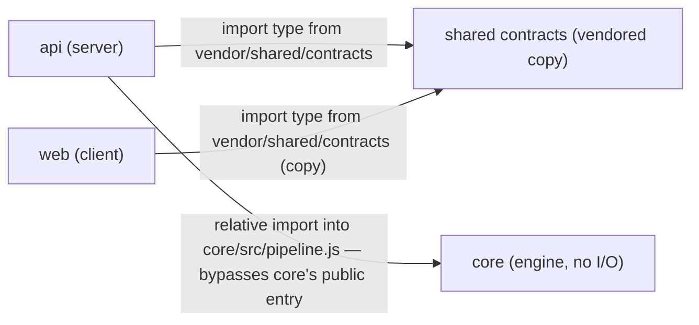

# Worked example — full dependency report

A complete report on a small fictional three-package repo (`api/`, `web/`, `core/`, same
shape as this repo's `server/`, `client/`, `reviewer-core/`), so the required structure is
visible end to end. Numbers and file names are invented for this example only.

---

## Scope

Analyzed `api/`, `web/`, and `core/` — the three packages with a `package.json` in this
repo. No other packages exist yet.

## Dependency graph

## Size & type breakdown

| Package | Dependency | Version | Kind | Installed size |
|---|---|---|---|---|
| api | express | 4.21.0 | dependencies | 3.1M |
| api | zod | 3.23.8 | dependencies | 2.1M |
| api | moment | 2.30.1 | dependencies | 4.2M |
| api | vitest | 2.1.4 | devDependencies | 41M |
| web | next | 15.0.3 | dependencies | 132M |
| web | react-dom | 19.0.0 | dependencies | 6.9M |
| web | date-fns | 4.1.0 | dependencies | 22M |
| web | zod | 3.22.4 | dependencies | 1.9M |
| core | zod | 3.23.8 | dependencies | 2.1M |

Sorted by size within each package; `web/node_modules/next` dominates `web`'s footprint by
an order of magnitude over everything else there.

## Findings & Priorities

**P0**
- `api/src/services/report-service.ts` imports `core/src/pipeline.js` directly by relative
  path instead of through `core`'s package entry point. `core` has no version boundary for
  this import — a refactor inside `core/src/pipeline.js` can break `api` with nothing to
  signal it. Route this import through `core`'s public export instead.
- `moment` is declared in `api/package.json` but `grep -rl "from 'moment'" api/src` returned
  no matches — 4.2M installed for a dependency nothing imports.

**P1**
- `zod` resolves to three different versions: `3.23.8` in `api` and `core`, `3.22.4` in
  `web`. `web` is the outlier and should track the other two, since `core`'s contracts are
  the source of truth `web` vendors from.

**P2**
- `web/node_modules/date-fns` is 22M; `web/src` only imports `format` and
  `differenceInDays` from it. Worth a look, not urgent — tree-shaking may already be
  trimming this in the production bundle, which a report from disk size alone can't confirm.

**Info**
- Total installed size across the three packages: ~213M, of which `web/node_modules/next`
  alone is ~62% — expected for a Next.js app and not itself a finding.

## Summary

1. **Route `api/src/services/report-service.ts`'s import of `core/src/pipeline.js` through
   `core`'s public entry point** — confirm with whoever owns `core` what that entry point
   is, since bypassing it is the highest-risk finding here (P0).
2. **Confirm `moment` is genuinely unused in `api/`, then remove it from
   `api/package.json`** — no import was found under `api/src`, but check build scripts and
   CI config before deleting, in case it's used outside `src/`.
3. **Bump `web/package.json`'s `zod` to `3.23.8`** to match `api` and `core`, so a future fix
   to the shared contract schema doesn't silently miss the client.
4. **Spot-check whether `web`'s production bundle actually tree-shakes `date-fns`** down
   from its 22M installed size before deciding whether to swap it for narrower imports.
