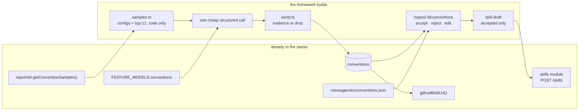

# L02 homework — Conventions Extractor + API Contract Reviewer

The umbrella plan for the L02 homework. It owns scope, sequencing and the exit
checklist; the per-package specs own the contracts and the verification:

| Package | Spec | Owns |
|---|---|---|
| `server/` | [`docs/specs/04-conventions.md`](../../server/docs/specs/04-conventions.md) | `conventions` module, sampling, extraction, evidence verification, skill draft |
| `client/` | [`docs/specs/04-conventions.md`](../../client/docs/specs/04-conventions.md) | `/repos/:repoId/conventions`, candidate cards, edit + create-skill modals |
| `reviewer-core/` | — (one export, specified in the server spec) | `INJECTION_GUARD` becomes public so a second untrusted-input path can reuse it |
| `demo/` | — (`record-conventions.ts`, specified below) | the screencast |

Two halves, one claim each:

1. **Conventions Extractor** — *the repo can tell you its own house rules, and
   every rule it proposes is backed by code you can click through to.*
2. **API Contract Reviewer** — *the same agent, same model, same PR: without its
   skills it misses the breaking change; with them it blocks the merge.*

The second half is not new work invented here — it is
[`L02-skills.md`](./L02-skills.md)'s control experiment, whose exit checklist item
is still open and which `demo/INSIGHTS.md` (2026-08-03) records as having "no
recorded evidence". This plan closes it.

## Problem

L02 made a Skill a first-class object: authored, versioned, linked to agents,
visible in the trace. It did not answer where the *first* skill comes from. Today
a person opens an empty editor and types out rules they already follow — the rules
are in the codebase, in every file, and nobody harvests them.

The extractor harvests them. It samples the repo with code (not a model), asks a
cheap model for candidate rules, and then **throws away every candidate that
cannot point at real code**. What survives is a review queue: accept, reject, edit,
and merge the keepers into one `repo-conventions` skill that any agent can load.

The grounding rule is not a new idea either — it is the review pipeline's own
invariant, applied one layer up:

> A finding that doesn't cite a real diff line is dropped. *(AGENTS.md)*
> A convention candidate that doesn't cite a real file+line is dropped.

## What already exists

Like L02, this is mostly wiring. The starter shipped the extension points and
they are all still empty:

- **Schema** — the `conventions` table (`db/schema/knowledge.ts`), never written
  to by anything.
- **Contract** — `ConventionCandidate` in `contracts/knowledge.ts`.
- **Sampling** — `RepoIntelService.getConventionSamples(repoId, n)` → top-N files
  by rank minus tests/configs/migrations. Already implemented, already tested.
- **Model selection** — `conventions` is in `FEATURE_MODELS`, and
  `feature-models.ts` explicitly reserves the "callers that keep their own dynamic
  default (e.g. conventions)" path for it.
- **Test doubles** — `MockLLMProvider.structuredBySchema` documents the intended
  schema names: `'ConventionFileSelection'` then `'ConventionExtraction'`.
- **Design** — `_assets/L02/DevDigest Design (standalone) (3).html` →
  `screen_conv_conf.jsx` (`ScreenConventions`, `ConventionCard`,
  `CreateSkillModal`, the empty state).
- **i18n** — `client/messages/en/conventions.json`, already written, unused.
- **Nav routing** — `activeKeyFor()` already maps `/conventions` → the
  `conventions` sidebar key. The `NAV` entry itself is missing.
- **GitHub deep-links** — `githubBlobUrl(fullName, sha, file, start, end)`.

What is missing is everything between them: no `conventions` module, no route, no
page, and no path from an accepted candidate to a saved skill.



## Scope decisions

Seven places where the requirements, the design and the existing code disagreed,
resolved before writing this:

1. **The model never writes the evidence snippet.** It returns
   `path + start_line + end_line`; the server re-reads those lines from the clone
   and stores what it read. A hallucinated snippet is then not "unlikely", it is
   *unrepresentable* — and the snippet on screen is always the code that is really
   there. This is the single most load-bearing decision in the feature.
2. **Sampling is code-only**, per the assignment: a config allowlist plus
   `getConventionSamples(repoId, 12)`. The two-step
   `ConventionFileSelection` → `ConventionExtraction` dialogue that
   `adapters/mocks.ts` anticipates stays out; it is listed under *Stretch* as the
   first quality lever, not the first implementation.
3. **Extraction is synchronous** (one request, one cheap model call, bounded
   `timeoutMs`), not a `JobRunner` job. ~15 capped files at ≤120 kB is seconds,
   the UI has one spinner instead of a poll loop, and `server/INSIGHTS.md`'s
   10-minute-provider-call warning is about full-diff reviews, not this. If it
   ever needs to move behind the queue, `repo-intel/routes.ts` is the pattern.
4. **`status` replaces `accepted`.** The table's `accepted boolean` cannot tell
   "not looked at yet" from "rejected", and the whole product claim is that
   *rejected candidates do not reach the skill* — which needs a third state to be
   observable. Migration `0013` drops the column; the table has never held a row.
5. **One skill, not many.** Accepted candidates merge into a single
   `repo-conventions` skill, grouped by category. Multi-skill export (one per
   category) is a `GROUP BY` away and is listed under *Stretch*.
6. **The draft is built on the server**, not in the modal. `GET
   …/conventions/skill-draft` reads `status = 'accepted'` and returns the merged
   markdown; the modal edits text, it does not decide membership. That keeps
   "rejected candidates never reach the skill" as one server-side assertion
   instead of a client invariant nobody can test.
7. **`api-contract-guard` is renamed to `breaking-change`** and joined by three
   siblings. Cost: `demo/record-skills.ts:274` selects it by name, and the L02
   stills in `docs/results/l02/` show the old name. Both are accepted — the L02
   PR froze its own claim, and one selector is a one-line edit. The alternative,
   keeping a name that no longer says what the skill does, is worse.

## Why the A/B experiment needs a prompt rework first

`API_CONTRACT_REVIEWER_PROMPT` (`db/seed-prompts.ts:335`) currently contains the
full breaking-change taxonomy:

```
# What counts as breaking
- A route's path, method, or required parameters change.
- A response field is removed, renamed, or changes type.
...
```

`api-contract-guard`'s body repeats it almost verbatim. So the "without skills"
arm of the experiment would *also* catch the breaking change, and the control
would show nothing — not because skills don't work, but because the knowledge was
never in the skill layer to begin with.

The fix is the shape the lesson is actually teaching: **the agent prompt holds the
role and the output discipline; the skills hold the domain rules.** So the prompt
keeps role, severity ladder, verdict rule and findings discipline, and loses the
taxonomy. Everything removed reappears in a skill, so the *with-skills* arm is
unchanged in capability — only the *without-skills* arm gets honestly weaker.

Four skills, each directive, each with a good/bad pair:

| Skill | Type | Catches | Arrives via |
|---|---|---|---|
| `breaking-change` | `convention` | route path/method/required-param changes, narrowed types, removed exports | seed (renamed from `api-contract-guard`) |
| `response-schema` | `convention` | a response field removed, renamed, retyped, or made optional→required | seed |
| `semver-discipline` | `rubric` | a change that demands a major bump, and whether the version moved | seed |
| `deprecation-policy` | `convention` | silent deletion where a deprecation window was owed | **import** (`.zip`, through the preview) |

At least one through import is an assignment requirement and re-walks the trust
gate; `uncovered-branch-gate` set the precedent in L02.

## Work packages

Sequenced so each one is independently demoable, and so the experiment does not
wait on the UI.

**W1 — schema + contracts.** Migration `0013` (`conventions` gains
`scan_id / category / evidence_start_line / evidence_end_line / status / skill_id
/ created_at`, drops `accepted`; new `convention_scans` table). Contracts in
`server/src/vendor/shared/contracts/knowledge.ts`, then
`./scripts/vendor-shared.sh`, then commit both copies.

**W2 — sampling + verification, no model.** `modules/conventions/samples.ts` and
`verify.ts`, both unit-tested against a fixture directory with no LLM in sight.
`verify.ts` is pure (contents in, verdict out) so its tests need no clone.

**W3 — extraction + routes.** `service.ts`, `prompt.ts`, the five routes,
`INJECTION_GUARD` exported from `reviewer-core`. After W3 the whole extractor is
exercisable over `curl`; the UI is not on its critical path.

**W4 — the page.** `/repos/[repoId]/conventions`, candidate cards with clickable
evidence, accept/reject/edit, the nav entry + its pin test.

**W5 — skill draft + create modal.** `skill-draft` / `skill` routes, the
`CreateSkillModal` port, link the created skill to an agent from the existing
Skills tab.

**W6 — the API Contract Reviewer rework.** Thin the prompt, write the four skill
bodies, reseed, build the `deprecation-policy` import archive, add
`docs/agent-prompts/api-contract-reviewer.md`.

**W7 — evidence.** The breaking-change PR, four runs (2 agents × with/without),
`demo/record-conventions.ts`, `docs/results/l02-homework/`.

## Control experiment

Same claim as L02, now actually run. Each case runs the same PR twice against the
same agent and the same model — once with skills unlinked, once linked. Nothing
else changes.

The PR under review is a real one on a genuinely imported repo, **not the seed**
(`server/INSIGHTS.md`: seeded PR files carry `patch: null`, so an agent has
nothing to ground against). Branch `demo/contract-break` off `dev-digest`, two
commits:

- rename `Skill.used_by` → `Skill.usedByAgents` in the shared contract and the
  DTO mapper — a response field rename, invisible to the compiler on the client
  because `vendor/shared` is a copy;
- change `GET /skills/:id/agents` to `GET /skills/:id/usage` without leaving the
  old path in place.

| Agent | Without skills | With skills |
|---|---|---|
| API Contract Reviewer | no CRITICAL: the rename reads as a refactor | CRITICAL on both, naming old shape → new shape → who breaks |
| Test Quality Reviewer | no finding | flags the uncovered branch and the boundary case |

Evidence per run: the trace's Prompt-assembly section (skills block present or
absent, with its token count), the findings list, and the run log's
`Loaded N skill(s) (X tokens)` line.

## Quality report on the extractor

The PR description must carry a short, honest read on what the extractor
produced — the assignment asks for it, and the numbers already exist on the
`convention_scans` row:

- files sampled (configs + ranked) and the SHA they were read at;
- candidates proposed vs kept, with the drop reasons broken out
  (`file_not_sampled` / `line_out_of_range` / …);
- of the kept ones, how many a human accepted, rejected, and edited — the real
  precision number, and the one worth being unflattering about.

Run it against `dev-digest` itself and against one unrelated work repo, and report
both. A rule the extractor gets *wrong* is more informative than five it gets
right.

## Exit checklist

- [ ] `POST /repos/:id/conventions/extract` returns candidates on a real repo,
      and each one's `evidence_snippet` is byte-identical to the clone at those
      lines.
- [ ] A candidate whose cited line does not exist is dropped, and the reason is
      recorded on the scan row rather than silently swallowed.
- [ ] The page lists candidates with accept / reject / edit, and the evidence link
      opens the file on GitHub at the cited lines, pinned to the indexed SHA.
- [ ] `repo-conventions` is created from the accepted set. A rejected candidate's
      rule text does not appear in the body — asserted in a test, not by eye.
- [ ] The created skill links to an agent and loads on a real run (visible in the
      run log and the trace).
- [ ] API Contract Reviewer misses the breaking change without its skills and
      reports it as CRITICAL with them, on the same PR and model.
- [ ] `deprecation-policy` arrived through the import preview and landed disabled.
- [ ] The demo video shows extract → review → edit → create skill → link → the
      A/B pair.
- [ ] The PR description carries the quality report above.
- [ ] `/pr-self-review` run by hand, verdict not BLOCKED.

## Stretch

Ordered by value per hour, all genuinely optional:

1. **Two-step selection** — an LLM pass that picks which of ~60 ranked files are
   worth reading before the extraction pass. This is what
   `'ConventionFileSelection'` in `adapters/mocks.ts` was left for, and it is the
   highest-leverage quality lever: the extractor is currently only as good as
   rank order.
2. **Feed `repo-intel` more than file text** — the symbol table and `file_facts`
   already hold exported signatures and endpoints per file. A candidate like
   "every route handler returns `Result<T, ApiError>`" is checkable against them
   instead of guessed from 180 lines of one file.
3. **Multi-skill export** — one skill per category instead of one merged body.
4. **Import from URL**, and packaging `repo-conventions` as a Claude Code plugin
   (`plugin.json` 1.0.0 + `marketplace.json`).
5. **Preserve decisions across re-scans** by normalized rule text, so a rejected
   rule does not come back every scan. Cheap (one `Map`), and specified in the
   server spec — promote it into W3 if the first re-scan is annoying.

## Out of scope

The Conformance Report that shares `screen_conv_conf.jsx` · memory/learnings
(`LEARNINGS` in the design fixture is a different feature) · eval runs over the
generated skill · per-candidate comment threads · extracting conventions from PR
review history rather than from the code.
