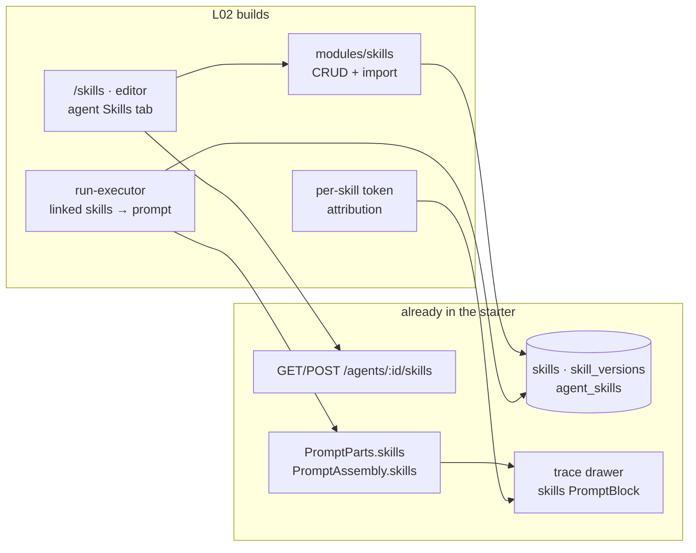

# L02 — Skills

The umbrella plan for the Skills feature. It owns scope, sequencing and the exit
checklist; the per-package specs own the contracts and the verification:

| Package | Spec | Owns |
|---|---|---|
| `server/` | [`docs/specs/03-skills.md`](../../server/docs/specs/03-skills.md) | skills module, import pipeline, run wiring, trace |
| `client/` | [`docs/specs/03-skills.md`](../../client/docs/specs/03-skills.md) | `/skills`, skill editor, agent Skills tab, import preview |
| `reviewer-core/` | [`docs/specs/01-skills-block.md`](../../reviewer-core/docs/specs/01-skills-block.md) | how a skill renders into the prompt |
| `e2e/` | [`docs/specs/01-skills-flow.md`](../../e2e/docs/specs/01-skills-flow.md) | the browser flow |

## Problem

An agent today is a model plus a system prompt. It reviews a diff on general
principles, and it has no way to know that *this* team requires a test for every
new branch, or that changing a route signature is a breaking change worth
blocking. Every such rule has to be pasted into the system prompt of every agent
that needs it, and drifts independently from then on.

**A Skill is that knowledge, extracted into a reusable, versioned markdown block
that many agents can share.** One skill, many agents, ordered per agent, and
each one visibly costs tokens on every run that loads it — so the product has to
show what the skill bought you.

## What already exists

This is mostly a wiring lesson, not a greenfield one. The starter shipped the
extension points:

- **Schema** — `skills`, `skill_versions`, `agent_skills` (all in migration
  `0000_init.sql`, all empty). No `CHECK` constraints on `type`/`source`; the
  Drizzle `enum` is TypeScript-only, so widening it costs no migration.
- **Contracts** — `Skill`, `SkillType`, `SkillSource`, `AgentSkillLink` in
  `contracts/knowledge.ts`.
- **Agent side of the link** — `GET/POST /agents/:id/skills`,
  `AgentsRepository.linkedSkills / setSkills / linkSkill / unlinkSkill`, and
  `agent_versions.config_json.skills` already snapshots the ordered skill ids.
- **The prompt slot** — `PromptParts.skills` and `PromptAssembly.skills` in
  `reviewer-core/src/prompt.ts`; `ReviewInput.skills` in `review/run.ts`.
- **The trace UI** — `TraceBody` already renders a separate skills `PromptBlock`
  whenever `prompt_assembly.skills` is non-null.
- **i18n** — `client/messages/en/skills.json` and the `agents.skills.*` /
  `editor.tabs.skills` keys.

What is missing is everything between them: no `skills` module, no `/skills`
route, no Skills tab, and — the load-bearing gap — **`run-executor.ts` never
passes `skills` to `reviewPullRequest`**, so the slot is always empty.

## Scope decisions

Four places where the requirements and the design disagreed, resolved before
writing this:

1. **Skills UI = both shapes.** `/skills` is a card grid with a side preview
   (the requirement), `/skills/:id` is the list + tabbed editor (the design).
   This is exactly the split `/agents` and `/agents/:id` already use, so the
   page shells, the card and the editor chrome are all ports of existing files.
2. **Import = markdown file + `.zip` archive**, both through a mandatory
   preview. Import-from-URL and the community catalog stay out of L02 — a
   network fetch is a second untrusted-input surface with its own allowlist and
   SSRF questions, and neither is needed to demonstrate trust.
3. **Two new agents** — Test Quality Reviewer and API Contract Reviewer. The
   control experiment is specified for both, and the exit checklist says "both".
4. **Skill editor = Config + Preview + Versions.** `skill_versions` already
   exists and snapshotting on save is a handful of lines. Evals and Stats stay
   as extension points for the lessons that build eval runs and pull/accept
   telemetry.

## The trust model

This is the part to get right, because there is a checked-in claim that
contradicts it.

A skill's body is **instructions in your agent's prompt**. That is what makes it
useful, and it is exactly why importing one from a stranger is a real decision
rather than a file copy. L02's answer is a boundary at *import* time, not at
prompt time:

1. **Nothing executable is ever read.** An archive is opened in memory, one
   markdown entry becomes the body, and every other entry — scripts, manifests,
   hooks, `allowed-tools` frontmatter — is listed as ignored and never opened,
   never stored, never run. This is checkable in a test, unlike a promise.
2. **Nothing is written before a human confirms.** Preview and save are two
   endpoints. The preview shows the exact body, what was ignored, and where it
   came from.
3. **An imported skill lands disabled.** It carries a "needs vetting" badge and
   contributes nothing to any prompt until a person turns it on.
4. **Once enabled by a person, it renders like any other skill** — as an
   instruction block, not as `<untrusted>` data.

Point 4 reverses a claim already in the repo: `client/messages/en/skills.json`
says an imported body is "stored as data (delimiter-wrapped)" and
`file.bodyHint` says pasted content is "never executed as instructions". Those
strings describe a posture that cannot work — a skill wrapped in `<untrusted>`
is a block the `INJECTION_GUARD` explicitly tells the model to ignore, so a
delimiter-wrapped skill would change nothing about the review and the control
experiment below would show no difference at all. **L02 rewrites those strings**
rather than leaving a stale claim to instruct the next reader (`server/INSIGHTS.md`,
2026-07-31: a reversed decision has to be reversed everywhere it is written
down). The honest replacement says what is actually true: this is someone
else's instruction text, you are about to adopt it, here it is in full.

The two product invariants are untouched: `INJECTION_GUARD` is not edited, and
grounding still drops any finding without a real diff citation — a skill can
add checks, it can never buy a finding an exemption.

## Workstreams

Ordered so each one is demonstrable on its own. W1–W3 are the vertical slice
that makes a skill change a review; W4–W6 are the product around it.

**W1 — contracts.** Widen `SkillSource` with `imported_file`; add
`SkillVersion`, `SkillUsage`, `SkillImportPreview`; add `config.skills` to
`RunTrace`. Server copy only, then `./scripts/vendor-shared.sh` — the client
copy is generated, and CI fails on drift.

**W2 — server skills module.** `modules/skills/{routes,service,repository,helpers}.ts`
plus one `app.register` line in `modules/index.ts`. CRUD, versioning on body
change, usage lookup. Migration `0012` adds the two indexes `skills` has never
had. No import yet.

**W3 — skills reach the model.** `renderSkillBlock` in `reviewer-core`, the
skills preamble in `assemblePrompt`, and the four lines in `run-executor.ts`
that resolve an agent's enabled links into `ReviewInput.skills`. Token
attribution via `container.tokenizer` lands here too, into `trace.config.skills`
and the run log. **After W3 the control experiment is already runnable** with
skills attached by SQL — the UI is not on the critical path for the product
claim.

**W4 — skills UI.** `/skills` grid + preview drawer, `/skills/:id` editor
(Config / Preview / Versions), nav entry, `lib/hooks/skills.ts`.

**W5 — agent Skills tab.** One entry in `AgentEditor/constants.ts` `TABS`, one
`SkillsTab` component over the existing `GET/POST /agents/:id/skills`. Reorder
writes the whole ordered set.

**W6 — import.** `POST /skills/import/preview` → `POST /skills/import/confirm`,
the zip reader with its caps, and the preview modal.

**W7 — content + evidence.** The two agents and their skills in the seed, the
import fixture archive, the control experiment, `docs/results/l02/`.

## Control experiment

The claim under test: *a skill changes what the agent finds, at a token cost you
can see.* Each case runs the same PR twice against the same agent and model —
once with the agent's skills unlinked, once linked. Nothing else changes.

| Agent | PR under review | Without skills | With skills |
|---|---|---|---|
| Test Quality Reviewer | a test covering only the happy path | no finding | flags the uncovered branch **and** the boundary case |
| API Contract Reviewer | a route signature change | no finding | flags the breaking change |

Evidence for each of the four runs: the run trace's Prompt assembly section, with
the skills block present-or-absent and its token count; the findings list; and
the run log's `Loaded N skill(s) (X tokens)` line. Promoted to
`docs/results/l02/` per [`docs/results/README.md`](../results/README.md).

Two things that will bite, both already recorded in `server/INSIGHTS.md`: seeded
PR files carry `patch: null`, so the experiment needs a genuinely imported repo,
not the seed; and a run can take minutes on `openrouter` — budget for it rather
than assuming a hang.

## Exit checklist

- [ ] `pr-self-review` exists with auto-invocation off, was invoked by hand, and
      visibly pulled both the frontend and the backend skills.
- [ ] A skill can be created and edited in the UI.
- [ ] Both new agents have skills linked.
- [ ] An enabled skill appears in the run log and the trace as its own block; a
      disabled one appears in neither.
- [ ] Import went through the preview, and nothing executable was run — the
      ignored-entries list in the preview is the proof.
- [ ] The control experiment reproduces on both agents.

The first item is a harness change, not a product one: the current
`.claude/skills/pr-self-review/SKILL.md` `description` is written to
auto-trigger ("Use before `gh pr create`, … when the user says the work is
done"). Turning that into an on-demand-only description is a one-line edit, but
note that `.claude/hooks/pr-guard.sh` gates `git push` / `gh pr create` on the
skill's verdict — verify the gate still behaves once the description no longer
invites automatic invocation.

## Out of scope

Import from URL · the community catalog · the conventions extractor that drafts
a skill from detected house rules (`screen_conv_conf.jsx`) · the Evals and Stats
tabs and everything behind them (`pull` / `accept` rates, eval runs, the Eval
Dashboard) · per-agent skill enablement independent of linking · CI export.
